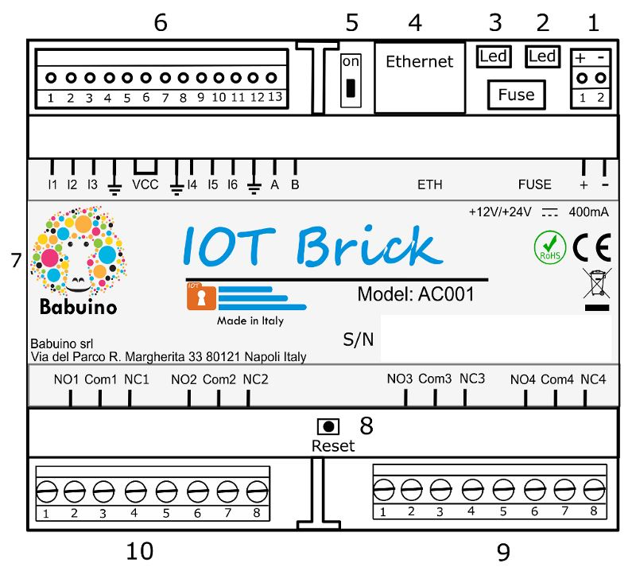

# IOT Brick Starter Kit

### The IOT solution ready when you are

---

Welcome to the Starter Kit for **IOT Brick - BR001**, the IOT solution that provides a general-purpose secure unit capable of a wide range of applications.  
The Starter kit is an IntelliJ Java-11 project, which contains the following:
- JAR library "SDK_IOTBrick.jar" for interacting with IOT Brick (see [Library](#library));
- Javadoc for the SDK library;
- Suite of hardware tests doubling as examples of SDK usage;
- Datasheet of **IOT Brick - BR001**;
- This Readme manual, with descriptions for every SDK component.


## About IOT Brick
**IOT Brick - BR001** is a secure unit designed as general-purpose IOT device by [Babuino Controllers](https://babuinocontrollers.com). It simplifies the design, the implementation and the deployment phases of IOT development, minimizing the time to market.

IOT Brick does not come with any application logic on board, which shall be configured according to the user requirements by simply arranging the provided Functional Blocks. Connecting together the inputs and the outputs of several functional blocks, a wide range of application logic can be implemented, **without any hardware or firmware development efforts**. This allows to focus resources on the application logic itself.

Each unit comes with six configurable  inputs (digital or analog) and four outputs (relay switches). Number of inputs and outputs can be extended by connecting additional units via RS485 or Ethernet.  
It can communicate and receive commands from any online device application implementing the SDK (Software Development Kit), available for JVM devices (desktop, Android, server...) and Swift (iOS, MacOS).
This also allows the device logic to be configured and/or changed remotely.

To purchase the IOT Brick device [contact us](https://www.babuinocontrollers.com/contacts/).  
More details about **IOT Brick - BR001** are in the [datasheet](https://github.com/BabuinoControllers/IOTBrick_StarterKit/raw/main/doc/20210929_BR001V1_EN.pdf).

<p align="left">
  <br />
  
  <br />
</p>


## Why IOT Brick?
Most IOT projects fail for similar reasons:
- Business objective not well-designed
- Technological complexity and lack of know-how
- Development costs including hardware and software
- Industrialization costs

On the other side, most IOT projects share common requirements. IOT Brick technology aims to share development, implementation and industrialization efforts of one project with others by providing a general-purpose device covering a wide range of applications that can be simply integrated in complex IOT architecture.

## From Development to configuration

Application logic can be easily implemented by configuring and combining these
functional blocks into the device. These are the result of research aimed at
supporting the widest possible range of use cases and applications.

Functional blocks have inputs and outputs. Logic is created by connecting the output of a functional block to the input of another. Several types of functional blocks are available:

- [Sensor](md/SENSORS.md) block: can read values from both the device’s inputs and the Functional Blocks’ inputs and outputs. Analog measurements are possible strictly from physical inputs, and may implement a Schmitt Trigger whose thresholds are fully configurable. Sensor blocks can also be read remotely by users.


- [Switch](md/DOORS.md) block: a switch Users may control remotely. It may be configured as either monostable (trigger/pulse) or bistable (on-off), and may implement further security measures such as PIN or Biometric (to be implemented client-side). Activation of a switch is conditional to a weekly time policy defined by the administrator.

- [Door](md/DOORS.md) block: a special type of Switch block, which controls the state of one of the four on-board relay switches.


- Mealy Machine: Implements a Mealy-based finite state machine with up to 8 inputs, 4 outputs, and 16 states. The machine's activity (including output variations) is subject to a weekly time policy defined by the administrator.


- [Digital Function Block](md/DFB.md):
  can implement any combinatory logic on 4 inputs and 1 output, and offers configurable outputs as monostable or bistable. The logic is set via a 4-digits hex string which represents the output column of the truth table of the desired logical function’s truth table. Transition delays between logical levels can be set. The block's activation is subject to a weekly time policy.


- [Weekly policy](md/ACCESS_POLICY.md) block: It defines a weekly time policy. Time policy is regulated by real time clock (RTC) operating in the board. Some of the functional block activities are regulated by the weekly time policy. Access control policy has a validity time defined by a starting time and an expiration time. Group access policy can be defined per user.


<p align="center">
  <br />
  
  <br />
</p>

## How to start
Clone locally the latest stable version of the Starter Kit, launch your IntelliJ IDE and open the project. Target JDK is Java-11.
Power on **IOT Brick - BR001** and connect to LAN. The Ethernet status LEDs and the device activity blue LED should start blinking. If the device is connected to the internet and is able to communicate with the server, the blue LED should alternate two fast blinks to a long pause.
Note: it is not required that the device connects to the server, as it can also be controlled over LAN.

There is no need to configure any IP address. The device implements a discovery protocol that allows applications to discover devices connected to the network. The only configuration required is to use the Serial Number and the initial password for the device in the [Connection](#connecting-to-iot-brick) phase. In order to execute the provided tests, these parameters shall be copied to [TestMain.java](src/main/java/MainTest/TestMain.java)

## System Reset and Factory Reset
Pressing the reset button for at least 5s causes a **system reset** (restart). 
Pressing for longer than 15s causes a **factory reset**, which erases all the information from the non-volatile memory of the device including logic configuration and users.

## Library
The **IOT Brick SDK Library** provides a comprehensive set of [objects](#objects) that mirror objects in the device. By interacting with these objects it is possible to interact remotely with the device.
The library is available in a Maven repository stored as [branch to the Starter Kit](https://www.github.com/BabuinoControllers/IOTBrick_StarterKit/tree/mvn-repo). It can be easily implemented as dependency for Maven or Gradle:
### Maven
```
// pom.xml

<repositories>
  [...]
  <repository>
    <id>SDK_IOTBrick_repo</id>
    <url>https://raw.githubusercontent.com/BabuinoControllers/IOTBrick_StarterKit/mvn-repo/</url>
  </repository>
</repositories>

<dependencies>
  [...]
  <dependency>
    <groupId>com.babuino</groupId>
    <artifactId>SDK_IOTBrick</artifactId>
    <version>5.0.0</version>
  </dependency>
</dependencies>
```

### Gradle
```
// top-level build.gradle
buildscript{
  [...]
  repositories{
    [...]
    maven{
      url 'https://raw.githubusercontent.com/BabuinoControllers/IOTBrick_StarterKit/mvn-repo/'
      name 'SDK_IOTBrick_repo'
      }
  }
}
```
```
// (:app) build.gradle
dependencies{
  [...]
  implementation 'com.babuino.SDK_IOTBrick:SDK_IOTBrick:5.0.0'
}
```

### Javadoc
Javadoc is available [here](https://github.com/BabuinoControllers/IOTBrick_StarterKit/raw/main/doc/javadoc.zip).

### Swift library
The SDK Library is also available in Swift for Apple devices (iOS, MacOS). If you need it,  please [reach out](https://www.babuinocontrollers.com/contacts/).

---
## Objects
On IOT Brick everything is an [object](md/OBJECT.md). Users are objects, functional blocks are objects, the device itself is considered an object. Objects share some common behaviour.

[Learn more about objects.](md/OBJECTS.md)

## Users
Users can remotely monitor the application and perform actions. Before any command sent by the User is executed, they must be authenticated (see [Security](#security).)

Three different roles can be assigned to users:
- **Super Administrator** has full access to all the features of the device, including hardware settings, log analysis and application logic configuration.

- **Administrator** is able to create and delete users, and define access policies.

- **User** is allowed to trigger Switches/Doors based on the policy defined by the administrators.

On average, 250 users can be registered with the system, Effective number of users depends on the settings. Each user has its own key which guarantees end-to-end security.

[Here find more about users.](md/USERS.md)

## Connecting to IOT Brick
[Here find more about connecting users.](md/CONNECTING.md)

## Security
Communication between Devices and User entities is protected by end-to-end security. The communication protocol creates a secure tunnel between Users and IOT Brick that protect exchanged data, guaranteeing authenticity, confidentiality, and integrity. Users are authenticated at each and every command through the end-to-end protocol. On top of that, for some commands and blocks such as Doors or Switches it is possible to enforce an additional level of user authentication through a PIN.

## Troubleshooting

Please [reach out](https://www.babuinocontrollers.com/contacts/) to the Babuino Controllers team for any technical issues or questions about the GitHub integration. We're happy to help!
