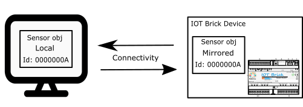

# Objects

### In IOT Brick Everything is an object

---
IOT Brick's logic follows an object-oriented paradigm: everything is an object with fields and methods. Users, functional blocks, access policies and all the other entities in the device are treated as objects. Each of these objects is based on the same class prototype and thus has certain fields and methods in common with the others. They are reported in the following.

## Mirroring and Method Invocation
SDK defines classes that mirrors the classes of objects that are present into IOT Brick. These provide all the support to remotely invoke methods of the objects stored into IOT Brick.

First, a Local object is instantiated. Then a method on local object is invoked. This method manages communication with the device so to remotely invoke the corresponding method on the mirrored object stored on the device.

So an object has two instances. One "LOCAL" instance off device, locally to a mobile phone or to computer and a "MIRRORED" object on the IOT Brick device. By interacting with the local object it is possible to interact transparently with the mirrored object. Communication is entirely managed by the SDK without any action of programmer.

<p align="left">
  <br />
  
  <br />
</p>

This is the code that shall be used in order to create a Door function block, set some fields and switch the door ON.
```          
	door = new Door(superA);                        
	door.setGpioId("00");                      
	door.setStatus(Door.SE_DOOR_ENABLED);
	door.update(superA);
	door.syncroFields(superA);
	   
	door.setOutput(superA, Door.DOOR_COMMAND_SWITCH_ON);
```
## Object Permanence
When an object instance is created into the device it is created into non-volatile memory and will be stored until explicitly deleted and its space recollected. Despite the objects themselves being stored permanently, some of their status may be stored in the RAM and is reset if the device is restarted.

## Object Identifier
Object identifier, or in short object ID, is a unique identifier of an object. It is assigned automatically by the IOT Brick operating system at object creation, and is a string of 8 hex digits. Object ID acts as a reference to the object on the device.

For example the string "00000003" is an object identifier.

In order to get the object identifier from an object:
```
	objectName.getObjectId();
```

## Object Name
Each object has a name. Name is a string of maximum 32 bytes. Initial value of object name after object instantiation is the object Id.

Use the set and get methods in order to set and get object name.
```
	objectName.getName();
	objectName.setName("Name");
```
## Object Activation Status
Each object usually has its activation status that can be Enabled or Disabled. If an Object is disabled it is not interacting any longer with Users. The only actions that can be performed by Administrators or Super Administrator on a disabled object is 'enable' or 'delete'.

## Object Synchronization
In order to bring the local object instance to the same status as the mirrored original into the device, syncroFields() method shall be called. The requesting User shall be passed in input to syncroFields method.

```
	objectName.syncroFields(User requester);
```

## Object Update
When a field of a local object is Set, the corresponding mirrored object into the device is not updated automatically. This shall be executed manually by performing update(), using the requesting User as parameter.
Since update involves network communication, it is recommended to perform all required settings on the object before pushing the update into the mirrored object on the device.

```
	objectName.update(User requester);
```

## Object Deletion
To delete an object instance on the device it is needed to call delete method on the corresponding local object. This action deletes the object on the device and reallocates its memory for new object allocations.
It does not delete the local copy in the client application.
Only users with privilege like Administrators and Super Administrator can delete an object. An exception is returned otherwise.

```
	objectName.delete(User requester);
```
